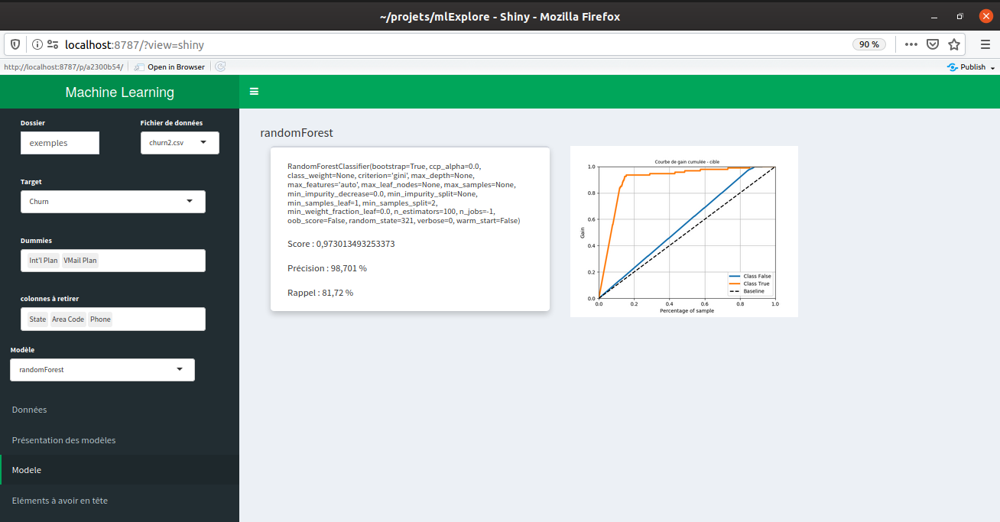

Objectif naïf du projet mlExplore
---------------------------------

Permettre aux utilisateurs de sélectionner des algorithmes compatibles
avec leurs données.

**Décrire un peu plus**

De quoi s’agit-il vraiment ?
----------------------------

### =&gt; Un outil pédagogique

Tout l’intérêt du projet ne se résume pas au produit final et
certainement pas à ses capacités de calcul :

Des outils graphiques pour gérer des problèmes ML, il en existe déjà
beaucoup

-   GCP
-   MatLab (The MathWorks)

**continuer ici la liste (non exhaustive)**

L’outil produit ici ne peut concurrencer sur le fond les acteurs
spécilistes du domaine depuis des années.

Il apporte plutôt une dimension pédagogique en présentant aux
*utilisateurs*

-   des algorithmes,
-   des modèles,
-   un concentré d’éléments de connaissances relatives au ML, adapté *à
    eux* puisque enrichi *par eux*.

Mais l’intérêt pédagogique ne se résume pas au produit fini.

Au contraire, l’élaboration elle-même du projet constitut l’essentiel de
la démarche engagée ici :

**énumérer ici les apports pédagogiques du projet**

Le projet n’a donc pas vocation a être terminé un jour, ce serait
tellement dommage (!)

### =&gt; Un produit Spyrales

Quoi de plus enthousiasmant qu’un premier outil totalement maîtrisé par
la communauté Spyrales puisque développé par elle et pour ses propres
objectifs.

Où en sommes-nous ?
-------------------

Au tout début…

Mais voyons d’un peu plus près sous 2 angles différents

### Du point de vue de l’utilisateur, que trouve-t-on dans ce projet ?

Une interface permettant de choisir nos propres fichiers pour les
soumettre au ML

Un premier modèle est proposé : Random Forest

### Du point de vue du développeur, qu’avons-nous appris/mis en oeuvre ?

Langages de programmation

-   R
-   python

Environnement de dev

-   Rstudio
-   ShinyApp

Bibliothèques

-   scikitlearn
-   panda

Que faire de plus ?
-------------------

**La liste va être longue…**

On peut commencer par…

### Corriger les bugs

1.  tous les fichiers utilisateurs .csv ne sont pas bien pris en compte

2.  

Conseils pour le bon démarrage de l’application
-----------------------------------------------

Après avoir récupéré tout le paquet (avec l’outil git à priori), je vois
2 options :

1.  le déposer dans le dossier ShinyApps s’il existe et qu’un serveur
    Shiny tourne sur votre machine locale.

2.  le déposer où bon vous semble pour le reconnaître ensuite dans vos
    projets à partir de l’environnement Rstudio.

C’est presque tout :

Option 1 : accédez classiquement depuis le navigateur à la page
@ip/users/votreUser/mlExplore/

Option 2 : sous Rstudio, se positionner sur global.R, ui.R ou server.R
puis runApp

Personnellement, je n’ai pas pris le temps d’installer (sur mon pc
nouvellement acquis) un server Shiny. Vous me direz si vous rencontrez
des problèmes en choisissant l’option 1, mais à priori il n’y aura pas
de soucis.

Je suis dans le cas de l’option 2

-   pour mon pc perso, tout fonctionne parfaitement.

-   et puis aussi sur une machine bien plus puissante …qui n’est pas à
    moi et à laquelle j’accède par ssh.

Il se trouve que l’affichage du DISPLAY sur la machine distante est un
peu rebel. Pour franchir l’obstacle, je n’ai rien trouvé de mieux que de
lancer le petit script python **plot.py** que vous trouverez dans
src\_python/ . Cela m’active l’affichage et tout fonctionne alors à
merveilles. C’est de la bidouille, conseillez moi vite un truc plus pro
si vous savez et avez du temps à consacrer à ça !

Et à quoi ça ressemble en images ?
----------------------------------

Vous demander de commencer par corriger les bugs, c’est pas très vendeur
je reconnaît.

Plus vendeur, une image :

